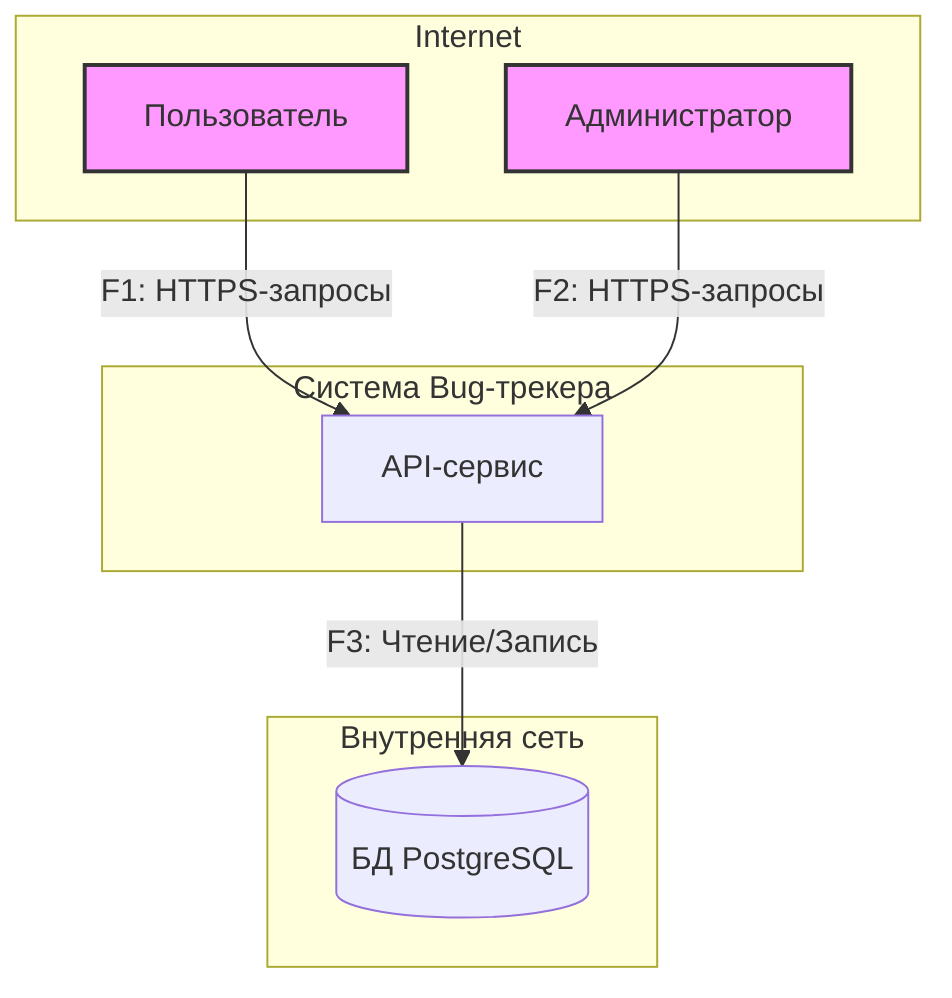
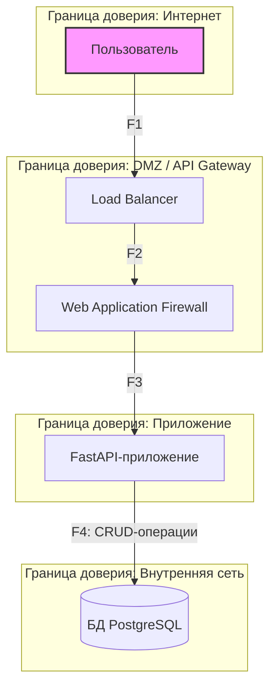

# DFD — Диаграммы потоков данных

## Уровень 1: Контекстная диаграмма

Это взгляд на систему "с высоты птичьего полета".



## Уровень 2: Логическая диаграмма компонентов

Декомпозиция API-сервиса на ключевые компоненты и границы доверия.



## Уровень 3: Диаграмма процессов внутри API

Детализация FastAPI-приложения на внутренние процессы (слои).

```mermaid
graph TD
    subgraph "Внешний мир"
        WAF[Web Application Firewall]
    end

    subgraph "Граница доверия: Приложение (FastAPI)"
        P1_1[Эндпоинты / Роутеры]
        P1_2[Сервисный слой]
        P1_3[Слой доступа к данным (Репозиторий)]
    end

    subgraph "Внутренняя сеть"
        DS1[(БД PostgreSQL)]
    end

    WAF -- F3.1: Запрос на создание пользователя --> P1_1
    WAF -- F3.2: Запрос на управление задачей --> P1_1

    P1_1 -- F5.1: Валидация и вызов сервиса --> P1_2
    P1_2 -- F6.1: Бизнес-логика и вызов репозитория --> P1_3
    P1_3 -- F7.1: SQL-запрос --> DS1

    DS1 -- F7.2: Ответ от БД --> P1_3
    P1_3 -- F6.2: Возврат данных --> P1_2
    P1_2 -- F5.2: Возврат данных --> P1_1
    P1_1 -- F3.3: HTTP-ответ --> WAF
